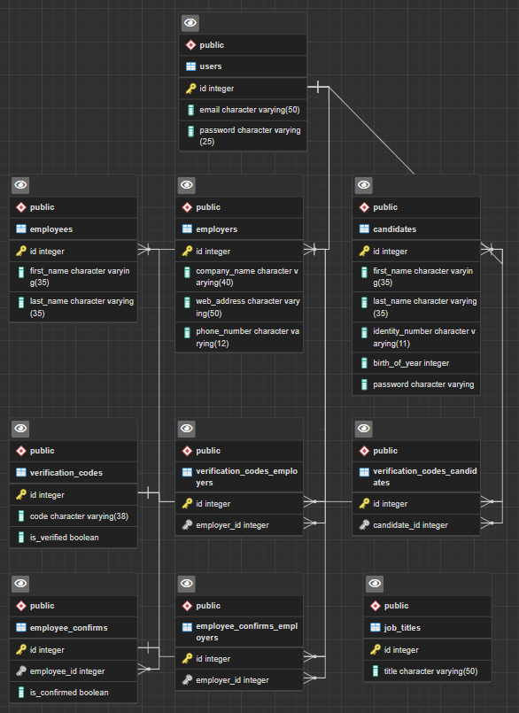

# hrmsDatabasePostgreSQL
Human Resources Management System - İnsan Kaynakları Yönetim Sistemi

- [FrontEnd-React](https://github.com/muazmemis/hrmsFrontEndReact)
- [BackEnd-Java](https://github.com/muazmemis/hrmsBackEndJava)
- 
* * *

### [Click](hrmsPostgreSql.sql) for database script codes.

* * *

### Tablo yapısı:
- **users** (*tüm kullanıcı türlerini saklayacağımız ana tablomuz*)
	- **candidates** (*iş arayan kullanıcılar*)
	- **employees**  (*sistem çalışanları*) 
	- **employers** (*iş veren kullanıcılar*)
	  - **employer_phones** (*iş verenlerin birden fazla telefonu olabileceği için ek bir tablo*)   
- **verification_codes** (*doğrulama sistemlerimiz için doğrulama kodlarını tutacağımız ana tablomuz*)
	- **verification_codes_candidates**  (*iş arayan kullanıcılar için kod ile doğrulama yapmak için tablomuz*)
	- **verification_codes_employers** (*iş veren kullanıcılar için kod ile doğrulama yapmak için tablomuz*)
- **employee_confirms** (*sistem çalışanlarının onaylama yapabilmesi için ana tablomuz*)
	- **employee_confirms_employers**  (*sistem çalışanlarının, iş verenlerini onaylayacağı tablo.*)
- **job_titles** (*iş pozisyonlarının isimlerini tutacağımız tablomuz.*)

* * *

### ER Diagram with DrawSQL

